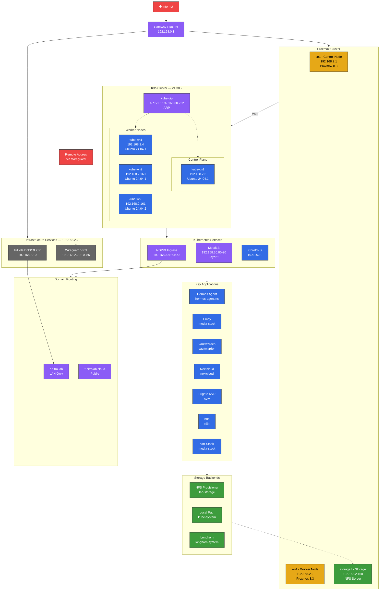
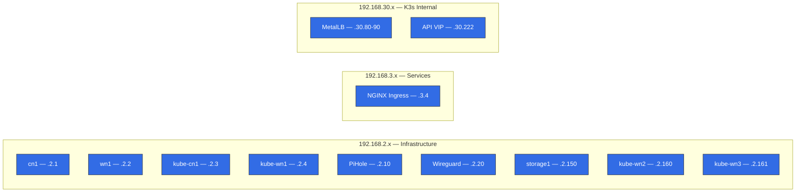
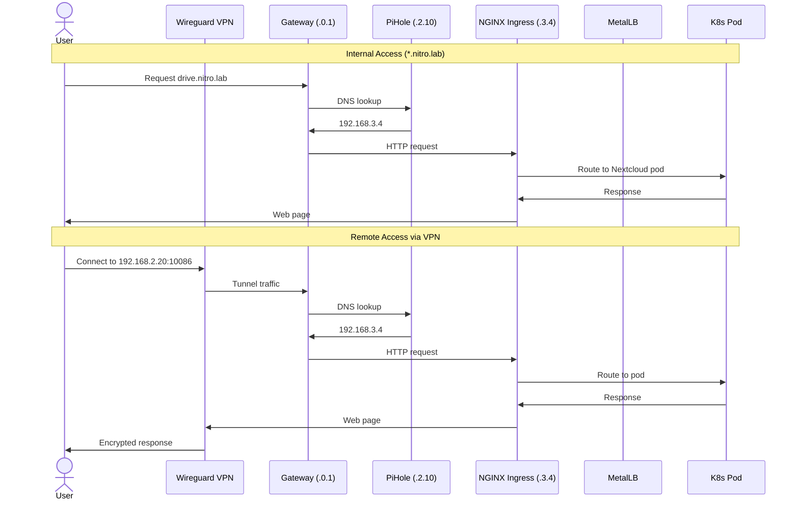

## Physical & Virtual Topology

```mermaid
graph TB
    %% Styles
    classDef proxmox fill:#e6a817,stroke:#333,color:#000
    classDef k8s fill:#326ce5,stroke:#333,color:#fff
    classDef infra fill:#666,stroke:#333,color:#fff
    classDef storage fill:#3d9c3d,stroke:#333,color:#fff
    classDef network fill:#8b5cf6,stroke:#333,color:#fff
    classDef internet fill:#ef4444,stroke:#333,color:#fff

    %% Internet
    INTERNET[🌐 Internet]:::internet

    %% Router
    ROUTER[Gateway / Router<br/>192.168.0.1]:::network

    INTERNET --> ROUTER

    %% Infrastructure Services
    subgraph INFRA [Infrastructure Services — 192.168.2.x]
        PIHOLE[PiHole DNS/DHCP<br/>192.168.2.10]:::infra
        WG[Wireguard VPN<br/>192.168.2.20:10086]:::infra
    end

    ROUTER --> INFRA

    %% Proxmox Cluster
    subgraph PROXMOX [Proxmox Cluster]
        direction TB
        CN1[cn1 - Control Node<br/>192.168.2.1<br/>Proxmox 8.3]:::proxmox
        WN1[wn1 - Worker Node<br/>192.168.2.2<br/>Proxmox 8.3]:::proxmox
        STORAGE1[storage1 - Storage<br/>192.168.2.150<br/>NFS Server]:::storage
    end

    ROUTER --> PROXMOX

    %% K3s Cluster
    subgraph K3S [K3s Cluster — v1.30.2]
        direction TB

        %% Control Plane
        subgraph CONTROL [Control Plane]
            KUBE_CN1[kube-cn1<br/>192.168.2.3<br/>Ubuntu 24.04.1]:::k8s
        end

        %% Workers
        subgraph WORKERS [Worker Nodes]
            KUBE_WN1[kube-wn1<br/>192.168.2.4<br/>Ubuntu 24.04.1]:::k8s
            KUBE_WN2[kube-wn2<br/>192.168.2.160<br/>Ubuntu 24.04.1]:::k8s
            KUBE_WN3[kube-wn3<br/>192.168.2.161<br/>Ubuntu 24.04.2]:::k8s
        end

        %% VIP
        KUBE_VIP[kube-vip<br/>API VIP: 192.168.30.222<br/>ARP]:::network

        KUBE_VIP -.-> CONTROL
        KUBE_VIP -.-> WORKERS
    end

    PROXMOX -->|VMs| K3S

    %% Cluster Services
    subgraph SERVICES [Kubernetes Services]
        direction LR
        INGRESS[NGINX Ingress<br/>192.168.3.4:80/443]:::network
        METALLB[MetalLB<br/>192.168.30.80-90<br/>Layer 2]:::network
        COREDNS[CoreDNS<br/>10.43.0.10]:::k8s
    end

    K3S --> SERVICES

    %% Key Pods
    subgraph APPS [Key Applications]
        direction LR
        HERMES[Hermes Agent<br/>hermes-agent ns]:::k8s
        EMBY[Emby<br/>media-stack]:::k8s
        VAULT[Vaultwarden<br/>vaultwarden]:::k8s
        NC[Nextcloud<br/>nextcloud]:::k8s
        FRIGATE[Frigate NVR<br/>cctv]:::k8s
        N8N[n8n<br/>n8n]:::k8s
        ARR[*arr Stack<br/>media-stack]:::k8s
    end

    SERVICES --> APPS

    %% Storage
    subgraph STORAGE_SUB [Storage Backends]
        NFS[NFS Provisioner<br/>lab-storage]:::storage
        LOCAL[Local Path<br/>kube-system]:::storage
        LONGHORN[Longhorn<br/>longhorn-system]:::storage
    end

    APPS --> STORAGE_SUB
    STORAGE_SUB -.-> STORAGE1

    %% Domains
    subgraph DOMAINS [Domain Routing]
        INTERNAL[*.nitro.lab<br/>LAN Only]:::network
        PUBLIC[*.nitrolab.cloud<br/>Public]:::network
    end

    INGRESS --> DOMAINS
    PIHOLE --> INTERNAL

    %% Remote Access
    WG_REMOTE[Remote Access<br/>via Wireguard]:::internet
    WG_REMOTE --> WG
    WG --> DOMAINS
```

## Subnet Overview

```mermaid
graph LR
    classDef subnet fill:#8b5cf6,stroke:#333,color:#fff
    classDef device fill:#326ce5,stroke:#333,color:#fff

    subgraph SUBNET2 [192.168.2.x — Infrastructure]
        direction TB
        S2_1[cn1 — .2.1]:::device
        S2_2[wn1 — .2.2]:::device
        S2_3[kube-cn1 — .2.3]:::device
        S2_4[kube-wn1 — .2.4]:::device
        S2_5[PiHole — .2.10]:::device
        S2_6[Wireguard — .2.20]:::device
        S2_7[storage1 — .2.150]:::device
        S2_8[kube-wn2 — .2.160]:::device
        S2_9[kube-wn3 — .2.161]:::device
    end

    subgraph SUBNET3 [192.168.3.x — Services]
        direction TB
        S3_1[NGINX Ingress — .3.4]:::device
    end

    subgraph SUBNET30 [192.168.30.x — K3s Internal]
        direction TB
        S30_1[MetalLB — .30.80-90]:::device
        S30_2[API VIP — .30.222]:::device
    end
```

## Traffic Flow

```mermaid
sequenceDiagram
    actor User
    participant WG as Wireguard VPN
    participant Router as Gateway (.0.1)
    participant DNS as PiHole (.2.10)
    participant Ingress as NGINX Ingress (.3.4)
    participant Metallb as MetalLB
    participant Pod as K8s Pod

    Note over User,Pod: Internal Access (*.nitro.lab)

    User->>Router: Request drive.nitro.lab
    Router->>DNS: DNS lookup
    DNS->>Router: 192.168.3.4
    Router->>Ingress: HTTP request
    Ingress->>Pod: Route to Nextcloud pod
    Pod->>Ingress: Response
    Ingress->>User: Web page

    Note over User,Pod: Remote Access via VPN

    User->>WG: Connect to 192.168.2.20:10086
    WG->>Router: Tunnel traffic
    Router->>DNS: DNS lookup
    DNS->>Router: 192.168.3.4
    Router->>Ingress: HTTP request
    Ingress->>Pod: Route to pod
    Pod->>Ingress: Response
    Ingress->>WG: Web page
    WG->>User: Encrypted response
```

## See Also

- [[Homelab - Overview]]
- [[Homelab - Network]]
- [[Homelab - Services]]
