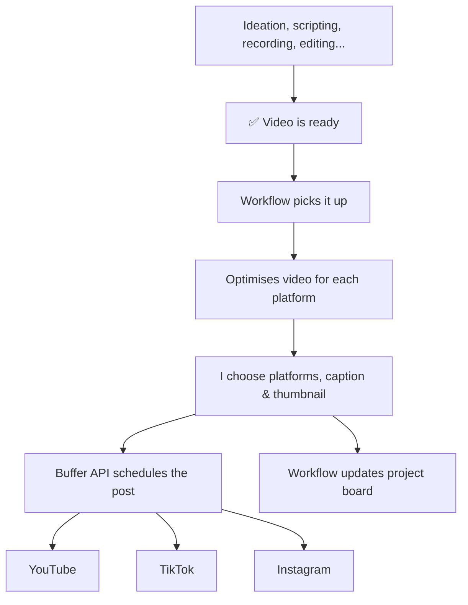

## Context

Mike from the [[Buffer]] marketing team reached out to feature me in a case study, based on work done with the Buffer API. Coordinating with Sabreen as well. Publishing target: **May 27** to align with video release.

## Questions

### 1. What did you build and what problem was it solving?

I built a desktop app for managing the [[coding.kitty]] workflow; an all-in-one production tool that handles everything from ideation and scripting through to subtitling, scheduling, and analytics.

The core problem was tool fragmentation. As a solo creator publishing across YouTube, TikTok, and Instagram, I was spread across a dozen tools that didn't talk to each other. Every finished video meant 15–20 minutes of busywork: downloading, re-uploading to each platform, writing captions, setting metadata, scheduling, and manually updating [[Jira]].

[[Buffer]] had already solved the multi-platform posting piece. But by integrating the [[Buffer]] API directly into [[coding.kitty]]'s custom engine, I could connect it to everything else - video files, caption generation, thumbnail selection, and project tracking. Turning a collection of disconnected tools into a single 2-minute workflow.

### 2. Why Buffer's API specifically?

A few reasons:

- Buffer already handles the complexity of posting to TikTok, Instagram, and YouTube. Building direct integrations with each platform's API would've meant dealing with three separate auth flows, three different upload mechanisms, three sets of rate limits and quirks. Buffer abstracts all of that behind a single GraphQL API.
- I didn't want to build my own job queue for timed publishing. Buffer handles the "post this at 3pm on Thursday" part reliably, and I can see everything in a calendar view. I want a guarantee that my posts will be posted at the specified time.
- Buffer API's graphql implementation is well-structured, supports everything I need (create, delete, fetch posts, fetch channels), and the response shapes are predictable. I was able to build a full integration in a few days.
- Buffer lets me pass YouTube titles, privacy settings, categories, Instagram reel vs. post type, first comments, and TikTok titles, all through a single mutation.

Building scheduling from scratch would've meant maintaining OAuth tokens for each platform, handling upload APIs that change frequently, building a scheduler service, and dealing with platform-specific edge cases. Buffer lets me focus on the creative workflow instead.

### 3. How does it all fit together?

**Where Buffer sits in the flow:**

1. A video is marked "ready to schedule" in Jira
2. coding.kitty's engine downloads the subtitled video from the Jira attachment
3. If targeting Instagram, it optimises the video dimensions with FFmpeg
4. The video uploads to Cloudflare R2 and gets a public URL
5. I pick platforms, generate a caption, and scrub the video to select a thumbnail frame
6. coding.kitty's engine calls Buffer's `CreatePost` GraphQL mutation with the video URL, caption, thumbnail, and all platform-specific metadata
7. Buffer fetches the video from R2 and queues it for publishing
8. The Jira ticket auto-transitions to the next status

The app also pulls scheduled posts back from Buffer to display a calendar view, and supports drag-and-drop rescheduling and inline caption editing (both done via delete + recreate since Buffer's API doesn't have an update mutation).

### Flow Diagram

### 4. What does this workflow let you do that wasn't possible before?

- **Publish to 3 platforms simultaneously from one screen.** No more switching between apps, re-uploading the same video, or copy-pasting captions.
- **Keep my project board in sync automatically.** When I schedule a video, the Jira ticket moves to the next column without me touching it. I always know what's published, what's queued, and what's still in progress.
- **See all upcoming content in one calendar.** I can spot gaps, avoid posting conflicts, and reschedule by dragging posts around.
- **Generate platform-aware captions instantly.** The AI knows the character limits and conventions for each platform, so I'm not manually rewriting the same message three times.
- **Schedule quiz carousels alongside videos.** I make image-based quiz posts from my video content and schedule those through Buffer too, in the same flow.
- **Build autonomous publishing workflows.** Because my custom engine has access to recent posts, analytics, and videos that are ready to go, an AI agent can work out in real time what to post next, picking the right content, platform, and timing based on live data — and schedule it through the Buffer API without me being in the loop at all.

The biggest shift is mental. I used to dread the publishing step because it was tedious and error-prone. Now it's a 2-minute task at the end of production, and I can batch-schedule a week's worth of content in one sitting.

## Logistics

- Format: written replies, call, or voice notes
- Publish date: May 27, 2026
- Goal: mutual boost with video on the same day

## See Also

- [[Buffer]]
- [[coding.kitty]]
- [[Jira]]
- [[Cloudflare R2]]
